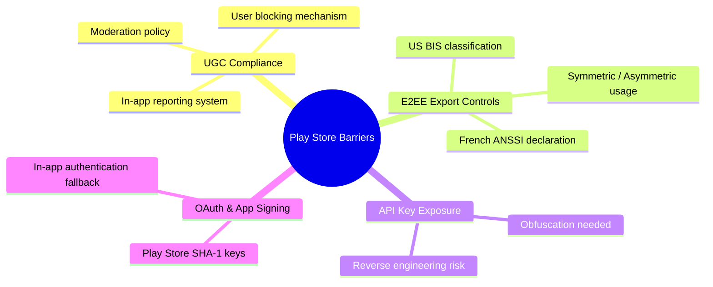

# Qbase: Google Play Store Publishing Readiness & Compliance Report

This document outlines key technical, policy, and compliance checks required to successfully publish Qbase on the Google Play Store without rejection or suspension.

---

## ⚡ Executive Summary of Key Barriers



---

## 1. User-Generated Content (UGC) Policy (Critical)

**Policy Context**: Since Qbase features group chats, peer-to-peer message exchanges, and shared study collections/sessions, Google classifies Qbase as an app containing **User-Generated Content (UGC)**. 

### Required Measures:
Google Play mandates that any UGC app must implement:
1. **Terms of Use / End User License Agreement (EULA)**: You must explicitly state that UGC violating local laws or containing harassment, hate speech, or explicit material is prohibited.
2. **In-App Reporting (Flagging) System**: Users must be able to flag inappropriate messages, collections, or sessions.
   - *Status in Qbase*: We have built reporting functions inside the session and collection views, but need to make sure flagged content actually triggers an administrative moderation queue or hides the content for the flagging user.
3. **Block Abusive Users**: Google requires a robust mechanism allowing users to **Block** or **Mute** offensive peers in the chat.
   - *Recommendation*: Implement a `blockUser(uid)` table and check it inside the active chat lists so that blocked users' messages are hidden.

---

## 2. End-to-End Encryption (E2EE) & US Export Compliance (EAR)

**Policy Context**: Qbase uses advanced cryptography (ECDH and AES-GCM keys) in `:core-crypto` to secure message exchanges.

### US EAR (Export Administration Regulations):
Any app utilizing non-standard cryptography or custom symmetric/asymmetric algorithms exported from the United States (via Google Play servers) must comply with US Export controls.
* **Mass Market Exemption**: Most apps using standard E2EE for peer-to-peer communication fall under **License Exception LVS** or **Mass Market classification (5A002)**.
* **Play Console Question**: When submitting the app, Google Play Console will ask:
  > *"Is your app designed to use cryptography, or does it contain encryption?"*
* **Action Required**: 
  1. Answer **Yes**.
  2. Declare that Qbase qualifies for **Mass Market Exemption** because it uses standard public/private algorithms (ECDH / AES-GCM) exclusively for user messaging.
  3. If distributing in France, you must also obtain a declaration approval from France's **ANSSI** agency (Google Play manages this declaration template in the Console).

---

## 3. Secure API Key Management (Reverse Engineering Risk)

**Technical Check**: Inside [`app/build.gradle.kts`](file:///home/dilshan/AndroidStudioProjects/Qbase/app/build.gradle.kts), Gemini, Groq, and DeepSeek API keys are compiled into `BuildConfig` fields:
```kotlin
buildConfigField("String", "GEMINI_API_KEY", "\"$geminiApiKey\"")
```

### The Barrier:
If you build Qbase into a production APK or AAB (Android App Bundle) and publish it, attackers can easily decompile the app (using standard reverse engineering tools like `JADX` or `Apktool`) and extract your raw API keys. This could lead to:
* Exhausted API quotas and high billing fees.
* Suspended developer keys from Google/Groq/DeepSeek due to policy violations.

### Recommended Fix:
1. **Backend Proxy (Best Practice)**: Instead of calling the Generative AI models directly from the client application using a local key, route AI-assisted queries through a secure Firebase Cloud Function or external server wrapper that holds the API keys.
2. **Key Obfuscation (Alternative)**: If a backend proxy is not viable for initial launch, use **DexGuard** or specialized ProGuard rules to obfuscate keys, or store them in a secure Native C/C++ library wrapper (JNI/NDK) which is significantly harder to reverse-engineer.

---

## 4. Play Console App Signing Certificate Bridging (OAuth & Sync)

**Technical Check**: Qbase uses Firebase Authentication (Google Sign-In) and Appwrite backend integrations.

### The Barrier:
When you build the app locally, Google Sign-In works because the app is signed with your local `debug.keystore`. However, when you publish on Google Play, Google strips your upload signature and signs the final APK using **Google Play App Signing**. 
* Because the signing keys change, Google Sign-In and cloud Firestore sync will **fail silently** in production.

### Recommended Fix:
1. Go to **Google Play Console** -> **Setup** -> **App Integrity**.
2. Copy the **SHA-1** and **SHA-256** certificate fingerprints of the **App Signing Key**.
3. Paste these fingerprints into your:
   * **Firebase Console** (under Project Settings -> General -> Android apps).
   * **Appwrite Project Console** (under Platforms).
4. Re-download and update the `google-services.json` config.

---

## 5. Required Play Store Legal Disclosures

To complete the Play Console submission, Google requires hosting legal drafts online:
1. **Privacy Policy Link**: Play Store requires a live HTTPS URL where users can read what data is collected.
   - *Status*: You have structured [`docs/legal/PRIVACY_POLICY.md`](file:///home/dilshan/AndroidStudioProjects/Qbase/docs/legal/PRIVACY_POLICY.md). You must host this markdown on your website or a GitHub Gist to provide the URL to Google.
2. **Data Safety Form Answers**:
   * **Personal Info**: Yes, collects Email & User IDs (for Auth).
   * **Messages**: Yes, collects in-app chat messages (for the messaging sync feature).
   * **Security**: Declare that **"All user-to-user data is encrypted in transit using cryptographic keys (AES-GCM/ECDH)"** and **"Users can request that their account data be deleted"**.
