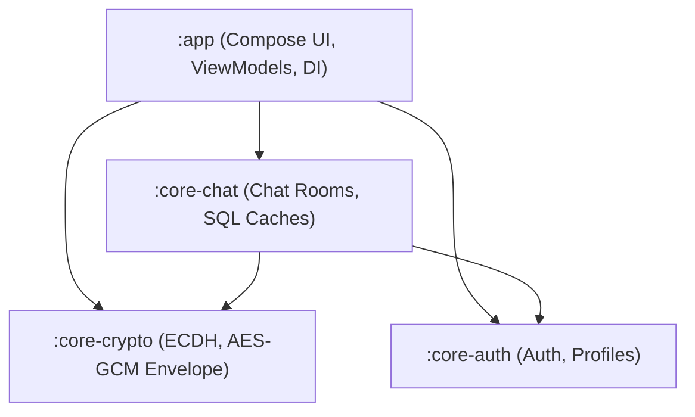
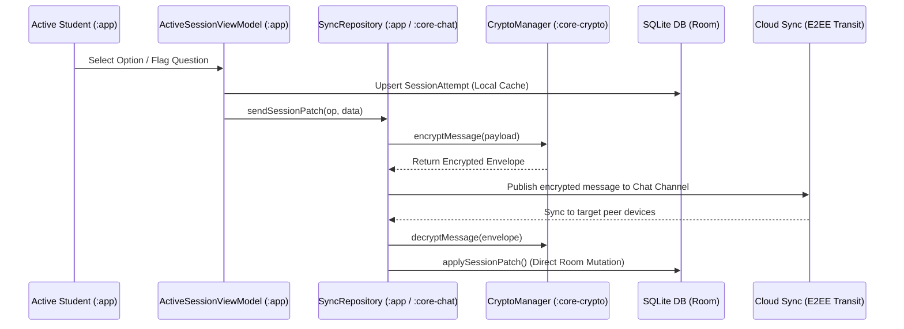
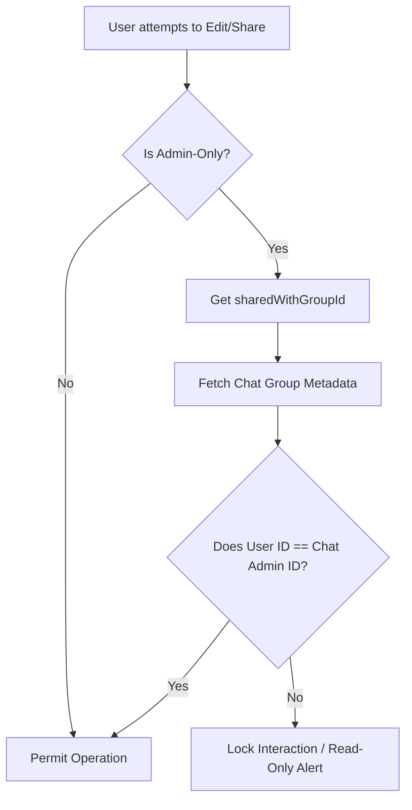

# Qbase Architectural Structure & Feature Integration Map

This document outlines the multi-module project structure of Qbase, the architectural design patterns employed, and how different features integrate seamlessly together across modules.

---

## 📂 Project Structure

Qbase is organized as a high-performance, modularized Android application conforming to Clean Architecture principles. It separates domain logic, UI frameworks, and data platforms into focused core modules.

### Module Descriptions
1. **`:app`**:
   - Contains the Compose UI screens (Explore, Sessions, Chat, Settings).
   - Manages state flows and UI interaction via Hilt ViewModels.
   - Orchestrates local repositories and initiates coordination tasks.
2. **`:core-crypto`**:
   - Central cryptosystem handling Android KeyStore keypairs, ECDH (Elliptic Curve Diffie-Hellman) shared-secret generation, and AES-GCM encryption/decryption envelopes.
   - Provides completely decentralized End-to-End Encryption (E2EE) utilities for transit message security.
3. **`:core-auth`**:
   - Manages user identity, secure authentication sessions, and profile caches.
4. **`:core-chat`**:
   - Controls chat databases, peer directory lookups, active group channels, and handles real-time network subscriptions.

---

## ⚡ Feature Integration Map

### 1. Real-Time E2EE Micro-Update (Delta-Sync) Pipeline
The real-time delta synchronization pipeline maps active student study sessions with peer-to-peer or group chats. 

When a user interacts with a quiz or session (such as answering or flagging a question), instead of pushing the whole dataset, a lightweight, encrypted **`SESSION_PATCH`** message is broadcasted.

#### Supported Operations (`SESSION_PATCH`):
* **`UPSERT_ATTEMPT`**: Sent instantly on selective user answer choices or flagging operations to update peer scoreboards.
* **`UPDATE_SESSION`**: Sent on final session submission or timing events to update progress benchmarks.

---

### 2. Collection Sharing & Administration
* **Admin-Only Setting**: Collections and Sessions can be locked with `isAdminOnly = true`.
* **Modification Check**: Before updating or adding questions to a collection, the view models check if `isAdminOnly` is true. If so, they verify if the local user is the administrator of the group chat linked via `sharedWithGroupId`. If the check fails, the user is given read-only access.
* **Sharing Restriction**: Only administrators of the linked group chat can share `isAdminOnly` collections or sessions to other chats.

---

## 💾 Core Databases & Bridging

Qbase handles data resilience using offline-first SQLite synchronization:
- **`AppDatabase`**: Room Database caching collections, questions, options, answers, sessions, and session attempts locally.
- **`ChatDatabase`**: Room Database caching chat rooms, group info, and messages.
- **`SyncRepository`**: Coordinates the data bridge, transforming database entities into serializable payloads, executing cryptographic routines, and performing background tasks to reconcile cloud sync streams into offline caches.
