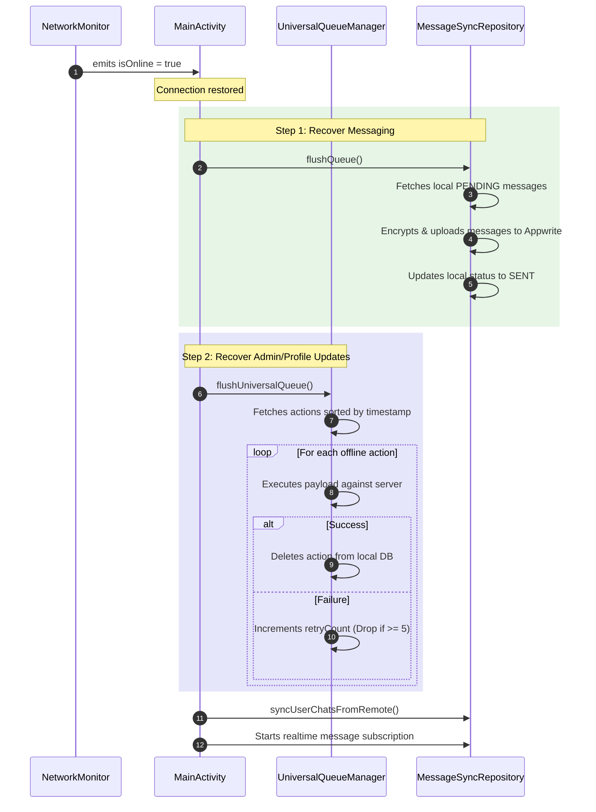

# Network Connectivity & Offline Resilience Audit Report

This report provides a comprehensive architectural audit of how network connectivity states (online vs. offline) are monitored, defined, and utilized within the Qbase application to dictate app behavior, trigger offline queues, and gate offline-incompatible features.

---

## 1. Network Connectivity Monitoring Engine (`NetworkMonitor`)

The app delegates network status detection to the `NetworkMonitor` utility class.

*   **Mechanism**: It leverages the Android system service `ConnectivityManager` to monitor active network connections.
*   **Reactive Flow**: It exposes connection status as a cold `Flow<Boolean>` (`isOnline`) using `callbackFlow` to listen for realtime network updates.
*   **Validation Rules**: Rather than just checking if Wi-Fi or Cellular data is connected, it validates actual connectivity:
    *   `NET_CAPABILITY_INTERNET`: The network has capability to route traffic to the public internet.
    *   `NET_CAPABILITY_VALIDATED`: The network has been validated by the Android OS to have actual data connectivity (no captive portals or dead routes).
*   **Performance Optimization**: Uses `.conflate()` on the Flow to prevent backpressure and avoid rendering redundant UI state updates when a connection experiences rapid flapping.

---

## 2. App Access & Network States (`AppAccessState`)

In `MainActivity.kt`, the application combines the authentication status (from `AuthRepository`) and the validated network state (from `NetworkMonitor`) to determine the global access mode.

| AppAccessState | Conditions | App Functionality & UI Behavior |
| :--- | :--- | :--- |
| **`RestoringSession`** | `!isSessionChecked` | App startup. Displays a loading screen while silently validating existing auth sessions without blocking UI interaction. |
| **`OnlineReady`** | `user != null && isOnline` | Full operational mode. Live message streaming, Appwrite cloud synchronization, real-time database subscription updates, and active AI capabilities. |
| **`SignedInOffline`** | `user != null && !isOnline` | Offline-resilient mode. Users view cached messages/collections. Group management, reports, and messages are queued locally. |
| **`GuestOnline`** | `user == null && isOnline` | Prompt to sign in. Allows standard user authentication via the Login/Register flow. |
| **`OfflineGuest`** | `user == null && !isOnline` | Strictly restricted mode. Prompts that internet is required to establish a user session. |

---

## 3. Core Capabilities & State Influence

Connectivity states heavily influence whether a feature executes immediately, gets queued for later synchronizations, or is gated off entirely.

### A. End-to-End Encrypted (E2EE) Messaging
*   **Online Execution**: Messages sent are encrypted locally via Tink (using public keys fetched from Appwrite user profiles), uploaded to the Appwrite `messages` collection, and received by peers in real-time. Once fetched, receipts are self-healed (deleted from cloud storage).
*   **Offline Queuing**: When a user sends a message while in `SignedInOffline`, the app intercepts it inside `ChatViewModel.sendMessage()`:
    1.  The message status is set to `PENDING`.
    2.  The message is stored locally in the Room database via `MessageDao.insertMessage()`.
    3.  A snackbar triggers: `"Offline: Message queued."`
    4.  No cryptographic failure or crash is thrown. Peer-to-peer message sending is paused until connection restoration.

### B. Chat & Group Administration
*   **Online Execution**: Actions like adding/removing group participants, updating roles, and group creation are committed directly to the remote Appwrite database.
*   **Offline Queuing**: Administrative actions are intercepted and routed through the **Universal Action Queue** (`UniversalQueueManager`). The action is logged inside the Room database (`Offline_Actions` table) with:
    *   `actionType`: e.g., `ADD_PARTICIPANT`, `REMOVE_PARTICIPANT`, `PROMOTE_ADMIN`, `DEMOTE_ADMIN`, `DELETE_CHAT`
    *   `payloadJson`: Serialized action metadata (e.g., `chatId`, `userId`)
    *   `retryCount`: Initialized at `0`.

### C. User Profiles & Settings
*   **Online Execution**: Changing a user profile metadata pushes update calls to Appwrite's users collection instantly.
*   **Offline Queuing**: Profile name and bio changes are updated locally in the cache and saved in the Universal Action Queue (`UPDATE_PROFILE`). They are eventually pushed to the server upon reconnection to prevent permanent client-server configuration drift.

### D. Moderation & Abuse Reporting
*   **Online Execution**: Abuse reports for messages, groups, sessions, and collections are sent directly to Appwrite collections for moderator review.
*   **Offline Queuing**: Moderation reports are queued (`REPORT_GROUP`, `REPORT_MESSAGE`) to ensure that safety reports are never dropped due to network issues.

### E. AI Brain & Quiz Generation (Gated Offline)
*   **Behavior**: Gated (Disabled).
*   **Rationale**: Querying the AI model via the `Gemini` API requires high-bandwidth bidirectional REST/WebSocket streaming. Queuing a quiz generation request or chatbot conversation does not fit interactive UX models. 
*   **Influence**: Entry points are deactivated when offline.

### F. File Transfers & Study Collection Sharing (Gated Offline)
*   **Behavior**: Gated (Disabled).
*   **Rationale**: Sending large ZIP binary payloads requires a stable network to execute Tink file encryption, Appwrite Storage chunk uploading, and download URL generation. Background WorkManager tasks for large files are complex and error-prone on unstable connections.
*   **Influence**: Collection ZIP uploads and downloads require an active internet connection.

---

## 4. Reconnection & Auto-Recovery Flow

When `NetworkMonitor` detects that connection shifts from `false` to `true`, the app initiates an automatic recovery sequence.

*   **Rate Limits and Safeguards**:
    *   To prevent infinite loops from malformed actions or server-side schema rejections, any offline action in the `UniversalQueueManager` that fails to execute is retried up to **5 times**. After 5 failures, the action is discarded.
    *   Incoming real-time messaging subscriptions are only restarted *after* the local queues are flushed to prevent race conditions in message delivery receipts.
