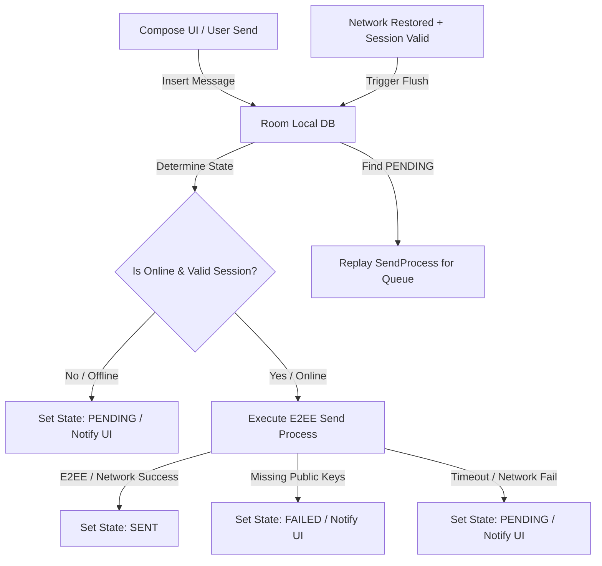

# Chat Queuing & Synchronization Architecture

This document outlines the offline-first message delivery and queuing flow in Qbase, detailing state transitions, end-to-end encryption (E2EE) pre-flight checks, and the automatic recovery/flush lifecycle.

---

## 1. High-Level Architecture Overview

Qbase implements an **Offline-First Chat Architecture**. The UI interacts exclusively with local Room database states, while background sync jobs manage replication and encryption handshakes with the Appwrite backend. 

---

## 2. Message State Machine (Room)

Every message is persisted locally with a defined delivery state. The states are defined as follows:

| State | Description | UI Representation | Action on Reconnection |
| :--- | :--- | :--- | :--- |
| `SENT` | Uploaded and encrypted successfully to Appwrite. | Solid Checkmark | None |
| `PENDING` | Queued locally due to lack of connection or transient network timeout. | Clock / Pending Icon | Re-attempted automatically on network restoration. |
| `FAILED` | Security or prerequisite failure (e.g., recipient missing encryption keys). | Alert Icon / Actionable Label | Blocked from auto-replay to prevent infinite loops. |

---

## 3. Detailed Send Lifecycle

### A. Offline Flow
When `isOnline` evaluates to `false` (meaning no internet, or the backend Appwrite session is invalid/expired):
1. The message payload is saved locally in Room with `status = "PENDING"`.
2. The VM fires a Toast/Snackbar notification: `"Offline: Message queued."`.
3. The queue remains passive until connectivity transitions back to active.

### B. Online Flow
When the app has active internet and a valid backend session:
1. The app speculatively inserts the message with `status = "SENT"`.
2. **Encryption Handshake (Pre-flight)**:
   - Queries Room and Appwrite for all participants' public encryption keys.
   - Generates a local symmetric session key to encrypt the payload.
   - Wraps (encrypts) the session key individually for each participant's public key.
3. **Upload**:
   - The encrypted payload and the mapped wrapped keys are sent to Appwrite via `databases.createDocument`.
   - On success, status is confirmed as `"SENT"`.
4. **Error Handling**:
   - **Missing Key Prerequisite**: If a recipient hasn't logged in on the latest version (missing public key on Appwrite), a `MissingEncryptionKeysException` is thrown. The message status is updated to `"FAILED"`, and the UI prints: `"Waiting for recipient encryption keys..."`.
   - **Transient Network Timeout**: If a connection reset or server timeout occurs during upload, the message status is updated to `"PENDING"`, and the UI prints: `"Network error: Message queued."`.

---

## 4. Reconnection & Auto-Flush

When the device regains connection, the app heals its state reactively:

1. **Session Re-Validation**: 
   When network availability transitions to `true`, `MainActivity` automatically runs `authRepository.checkCurrentSession()` to ensure the backend session is authenticated and valid.
2. **Sync Launch**:
   Once BOTH the network is active AND the session is valid, the combined `isBackendReady` flow emits `true`.
3. **Flush Queue**:
   The sync job calls `syncRepository.flushQueue()`, which:
   - Queries Room for all `"PENDING"` messages.
   - Iterates through the list, re-invoking the encryption and upload process for each message.
   - Changes successfully sent messages to `"SENT"`.
